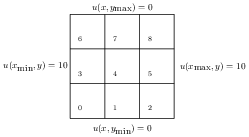

# Project 3


In this project the objective is to solve the two-dimensional Laplace equation using AztecOO, i.e.


with constant boundary conditions.  A finite difference discretization allowing for varying grid sizes in the  and  directions results in


Your assignment is to complete the class `TwoDimLaplace`.  The class should have a constructor of the form

```python
TwoDimLaplace(comm, nx=10, ny=10, xmin=0.0, xmax=10, ymin=0.0, ymax=10)
```

where `nx` and `ny` are the number of grids in the  and  directions.  The other arguments should be obvious.  Use a grid numbering scheme as shown in the following illustration



when constructing your Epetra linear system.  Understand the illustration is just an example, but your code should be more general such that it can solve  size problems with arbitrary constant boundary conditions applied to any side.

You must implement a function `set_boundary_condition(side='top', value=10)` to apply constant boundary conditions to the sides (a value of 10 on the top in this example).  

You must also implement `load_balance()` to load balance the problem using Isorropia and `solve()` to solve the linear system using AztecOO; however, if you are clever, you should be able to write this class such that it inherits from [Homework Assignment 19](https://github.com/PGE383-HPC-Fall2018/assignment19) where those functions were already implemented.

Finally, implement `get_solution()` so that it returns a Numpy array of the solution vector that has been gathered to the rank 0 processor.  The intended use of this class and the required functions should be clear by inspection of the example at the bottom of [project3.py](project3.py)

Your code should be parallel consistent, i.e. it should produce the exact same answer independent of the number of processors you specify.

## Testing

If you would like to check to see if your solution is correct, run the following commands at the Terminal command line:

```bash
mpiexec -np 1 python test.py
mpiexec -np 2 python test.py
mpiexec -np 3 python test.py
```
